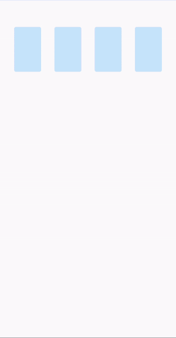
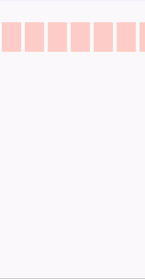
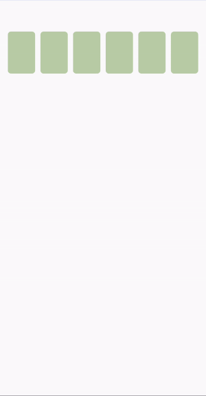
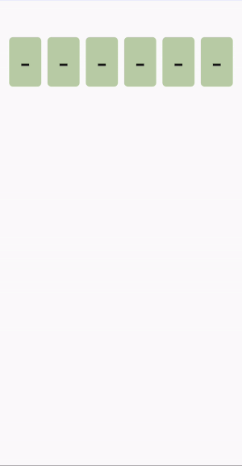

CodeTextField
===============

[](https://opensource.org/licenses/Apache-2.0) [](http://developer.android.com/index.html) [](https://android-arsenal.com/api?level=21) [](https://jitpack.io/#lukelorusso/CodeTextField) [](https://developer.android.com/jetpack/compose)

## Presentation ##

This is the source code of an Android Composable: `-=:[ CodeTextField ]:=-`

- - -

## Why would you need it? ##

*"Input codes easily, numbers or alphabetical, long or short, visible or masked, shown as you like!"*

**Introducing a fancy and highly customizable TextField, redesigned for codes input, MADE WITH JETPACK COMPOSE.**

What you got:
- chose the max length
- use it with any inputType
- you can mask your input AND choose the character you want to mask it
- customize the layout as you like
- horizontal scroll with auto-focus while typing
- and much more!







- - -

## How to use it? ##

Step 0. be sure that your Android project is ready for  [**Jetpack Compose**](https://developer.android.com/jetpack/compose/interop/adding)

##### DISCLAIMER #####

This code is licensed under the __Apache License Version 2.0__, _which means that_ you can freely use, modify, distribute and sell this code without worrying about the use of software: personal, internal or commercial.

**Just remember to keep the JavaDoc which contains the Copyright mention** (the part which starts with `/**` and ends with `*/` for instance)

Step 1. add the JitPack repository to your ROOT build.gradle at the end of repositories:

```groovy
allprojects {
    repositories {
        ...
        maven { url 'https://jitpack.io' }
    }
}
```

Step 2. add the dependency:

```groovy
    implementation 'com.github.lukelorusso:CodeTextField:1.0.0'
```

Step 3. use it in your Composable content:

```kotlin
    CodeTextField()
```

...eventually adding more useful parameters:

```kotlin
    CodeTextField(
        modifier = Modifier
            .padding(vertical = 60.dp),
        initialText = "123",
        maxLength = 12,
        inputType = InputType.TYPE_CLASS_NUMBER,
        charEmptyPlaceholder = '-',
        charMasker = '•',
        charTextModifier = Modifier
            .padding(horizontal = 3.5.dp)
            .height(59.dp)
            .width(42.dp)
            .background(
                color = Color(0xFFFAC8C8),
                shape = RectangleShape
            ),
        charTextCurrentModifier = Modifier
            .padding(horizontal = 3.5.dp)
            .height(59.dp)
            .width(42.dp)
            .background(
                color = Color(0xFFFAC8C8),
                shape = RectangleShape
            )
            .drawBehind {
                drawLine(
                    color = Color.Red,
                    start = Offset(x = 0f, y = size.height),
                    end = Offset(size.width, y = size.height),
                    strokeWidth = 4.dp.toPx()
                )
            },
        charTextStyle = LocalTextStyle.current.copy(
            fontSize = 22.sp
        ),
        scrollAnimationSpec = SpringSpec(stiffness = Spring.StiffnessLow),
        onTextChanged = ::onTextChanged
    )
```

That's it!

- - -

# Customization #

For a complete list of the possible customizations, please refer to the JavaDoc of the **CodeTextField.kt** file! 😉
It's all up to you!

- - -

# Explore! #

Feel free to checkout and launch the example app 🎡

Also, see where using this code has been the perfect choice:

[](https://play.google.com/store/apps/details?id=com.swissquote.android)  
[**Swissquote Trading**](https://play.google.com/store/apps/details?id=com.swissquote.android)

- - -

# Copyright #

Make with 💚 by [Luca Lorusso](http://lukelorusso.com), licensed under [Apache License 2.0](http://www.apache.org/licenses/LICENSE-2.0)
